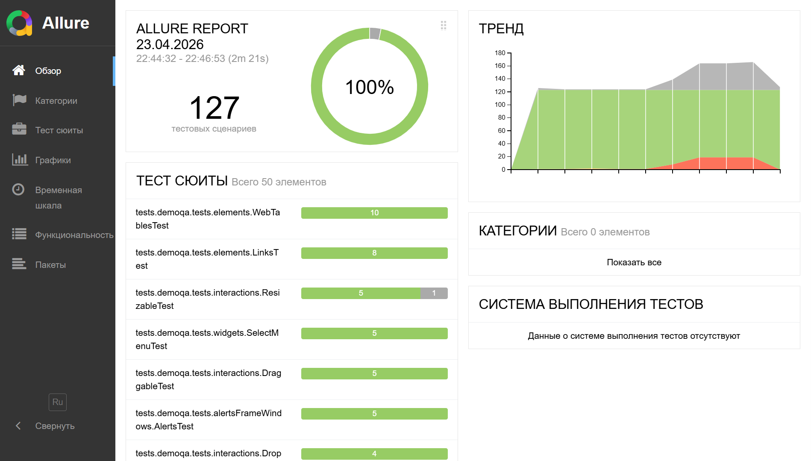

# 🧪 QA Automation Pet Project

A test automation project showcasing UI and API testing skills.  
Covers the [demoqa.com](https://demoqa.com) web application (UI + API) and the [reqres.in](https://reqres.in) REST API.

**124 tests** — 90 UI, 14 DemoQA API, 19 Reqres API, 1 Disabled.

📊 **[Allure Report (GitHub Pages)](https://brolanv.github.io/QA-PetProject/)**

---

## 📑 Table of Contents

- [Tech Stack](#-tech-stack)
- [Test Coverage](#-test-coverage)
- [Project Structure](#-project-structure)
- [Key Features](#-key-features)
- [How to Run](#-how-to-run)
- [Allure Report](#-allure-report)

---

## 🛠 Tech Stack

<p align="center">
  <a href="https://www.java.com/"></a>
  <a href="https://maven.apache.org/"></a>
  <a href="https://junit.org/junit5/"></a>
  <a href="https://selenide.org/"></a>
  <a href="https://rest-assured.io/"></a>
  <a href="https://allurereport.org/"></a>
  <a href="https://github.com/features/actions"></a>
  <a href="https://www.jenkins.io/"></a>
  <a href="https://www.docker.com/"></a>
  <a href="https://www.selenium.dev/documentation/grid/"></a>
  <a href="https://projectlombok.org/"></a>
  <a href="https://www.datafaker.net/"></a>
</p>

| Category | Technologies |
|----------|-------------|
| Language | Java 17 |
| Build | Maven |
| Test Framework | JUnit 5, JUnit Pioneer |
| UI Tests | Selenide |
| API Tests | REST Assured |
| Test Data | Datafaker, Lombok |
| Reporting | Allure Report |
| CI/CD | GitHub Actions, Jenkins |
| Infrastructure | Docker, Selenium Grid |

---

## ✅ Test Coverage

### UI Tests (demoqa.com)

| Section | Pages |
|---------|-------|
| **Elements** | TextBox, CheckBox, RadioButton, WebTables, Buttons, Links, BrokenLinks, Upload/Download, DynamicProperties |
| **Forms** | Practice Form (positive and negative scenarios) |
| **Alerts, Frame & Windows** | BrowserWindows, Alerts, Frames, NestedFrames, ModalDialogs |
| **Widgets** | Accordion, AutoComplete, DatePicker, ProgressBar, Slider, Tabs, ToolTips, Menu, SelectMenu |
| **Interactions** | Sortable, Selectable, Resizable, Droppable, Draggable |

### API Tests

| API | Coverage |
|-----|----------|
| **DemoQA BookStore** | Registration, authorization, token generation, CRUD operations for books and users |
| **Reqres.in** | CRUD operations for users, registration, login, list and resource validation |

---

## 📁 Project Structure

```
src/test/java/
├── helpers/
│   └── AllureAttachmentsExtension   # Screenshots and page source on failure
├── tests/
│   ├── demoqa/
│   │   ├── data/                    # Test data (PracticeFormData, WebTablesData)
│   │   ├── pages/                   # Page Objects
│   │   │   ├── alertsFrameWindowsPage/
│   │   │   ├── elementsPage/
│   │   │   ├── formsPage/
│   │   │   ├── interactionsPage/
│   │   │   └── widgetsPage/
│   │   └── tests/                   # UI and BookStore API tests
│   │       ├── alertsFrameWindows/
│   │       ├── bookStoreApplication/
│   │       │   ├── baseTest/        # BaseApiTest for BookStore
│   │       │   └── pojo/            # BookData, UserData, DefaultData
│   │       ├── elements/
│   │       ├── forms/
│   │       ├── interactions/
│   │       └── widgets/
│   ├── reqres/
│   │   ├── pojo/                    # UserData, ResourcesData, RootData
│   │   ├── tests/                   # Reqres API tests
│   │   ├── APIReader                # API key reader (env → file fallback)
│   │   └── BaseApiTest              # Base class with RequestSpec
│   └── specifications/
│       └── Specifications           # RequestSpec / ResponseSpec for all APIs
```

---

## 💡 Key Features

- **Page Object Pattern** — UI tests are built on page objects with Selenide, each page encapsulates locators and actions
- **Allure Integration** — `@Epic`, `@Feature`, `@Story`, `@Step`, `@Severity`, `@Description`; failure screenshots via `AllureAttachmentsExtension`; HTTP request logging via `AllureRestAssured`; Selenide steps via `AllureSelenide`
- **Parallel Execution** — JUnit 5 parallel execution (3 threads), Reqres API tests isolated with `SAME_THREAD` to prevent rate limiting
- **CI/CD** — GitHub Actions with automatic Allure report generation on GitHub Pages; Jenkins pipeline with Selenium Grid in Docker
- **Security** — API keys are never committed to the repository; stored in GitHub Secrets and Jenkins Credentials; `APIReader` implements env → file fallback
- **Retry** — flaky tests (drag-and-drop, hover, dynamic properties) are annotated with `@RetryingTest` + `@Flaky` via JUnit Pioneer
- **Test Data** — generated with Datafaker, models defined with Lombok (`@Builder`, `@Getter`, `@EqualsAndHashCode`)

---

## 🚀 How to Run

### Locally

```bash
# Clone the repository
git clone https://github.com/BRolaNV/QA-PetProject.git
cd QA-PetProject

# Create config.properties from the example
cp src/test/resources/config.properties.example src/test/resources/config.properties
# Add your reqres.in API key

# Run all tests
mvn test

# Generate Allure report locally
allure serve target/allure-results
```

### GitHub Actions (CI)

Tests run automatically on push to `main`. Allure report is published to [GitHub Pages](https://brolanv.github.io/QA-PetProject/).

### Jenkins + Selenium Grid (Docker)

```bash
# Start infrastructure
cd infrastructure
docker compose up -d

# Jenkins: http://localhost:9090
# Selenium Grid: http://localhost:4444
```

Pipeline: `Checkout` → `Build` → `Test` (API key via `withCredentials`) → `Allure Report`

---

## 📊 Allure Report

<p align="center">
  
</p>

---

<p align="center">
  <b><a href="https://github.com/BRolaNV">BRolaNV</a></b>
</p>
